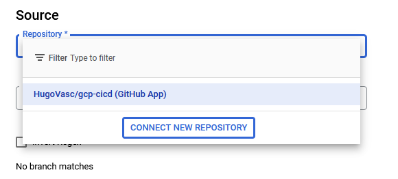

# Projeto CI-CD Utilizando o Google Cloud Build e Terraform

Os arquivos base para o projeto foram obtidos do seguinte [repositório](https://github.com/digitalinnovationone/terraform-gcp)

Passos para a configuração do GCP:

1. Criação do bucket para possibilitar a persistência do estado do Terraform no Cloud Storage

2. Configurou-se um trigger para automatizar o acionamento do pipeline

3. Adicionou-se um novo repositório ao Cloud Build

4. Finalizou-se a configuração do trigger

Após essas configurações aplicadas, basta realizar um push em qualquer branch do repositório selecionado e o Cloud Build inicia o pipeline de deploy da aplicação
